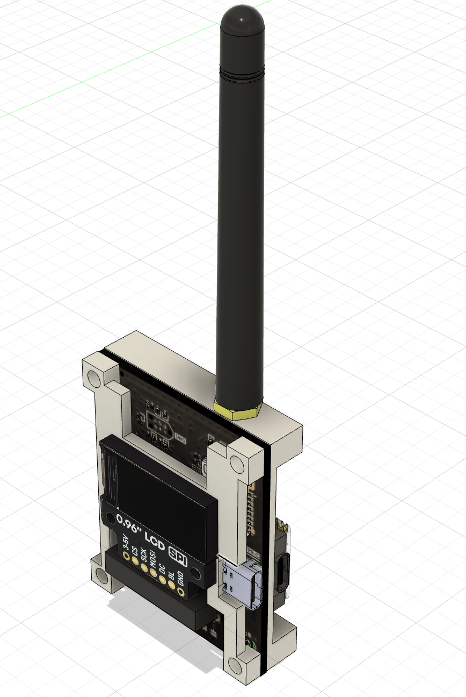

[![LinkedIn][linkedin-shield]][linkedin-url]

<!-- PROJECT LOGO -->
 

  

<h3 align="center">SensLink-Vision</h3>

  

    Custom STM32F4-based LoRa Transceiver with IMU, Baro and Laser Range Finder
     
    <a href="https://github.com/Devashrutha/SensLink-Vision"><strong>Explore the docs »</strong></a>
     
  

<!-- TABLE OF CONTENTS -->

  
Table of Contents

  <ol>
    <li>
      <a href="#about-the-project">About The Project</a>
    </li>
  </ol>

<!-- ABOUT THE PROJECT -->
## About The Project
SensLink is a custom LoRa Transceiver. It can store and transmit sensor data to a portable ground station module. The PCBs were designed using `Altium Designer` and `KiCad`. This project took much time and effort and is still a work in progress. It is the culmination of everything I learned during my engineering and my love for drones. Although it is still a work in progress in the programming department, fully written in `C/C++,` it is at a stage where it can be used.

  

The entire project was first designed in `Fusion 360` to create a frame incorporating all components. This makes it compact to be mounted on drones or any other vehicle.

  

  

  

The main PCB containing the `STM32F411CE` was designed in `Altium` while the `LoRa Transceiver PCB` was designed in `KiCad`. The main board comprises an `MPU-6050` IMU, a `BMP280` barometer, and a `VI53L1X` laser range finder. An onboard SD card reader can log the data read from the sensors. A `type C` connector can stream data using a `virtual COM port`. The SD card traces are length-matched so that the data transmitted and received from the MCU happens without delays. This mitigates the corruption of the sensor data while logging.

  

  

I used two boards, one for data collection and the other as a ground station. Both use `LCD screens that stream the sensors' data in real time. An `RP2040` is used to drive these displays.

* MPU-6050 uses I2C for data communication.
* BMP-280 uses I2C for data communication.
* VI53L1X uses I2C for data communication.
* The LORA Ra-02 module uses USART for data communication between the module and MCU.
* The displays use SPI for data communication.
* The SD card uses SDIO for data communication.

All of this would not be possible if not for the open-source libraries that were available for the sensors and STM32-CUBE IDE.

(<a href="#readme-top">back to top</a>)

[linkedin-shield]: https://img.shields.io/badge/-LinkedIn-black.svg?style=for-the-badge&logo=linkedin&colorB=555
[linkedin-url]:https://www.linkedin.com/in/devashrutha-s/
